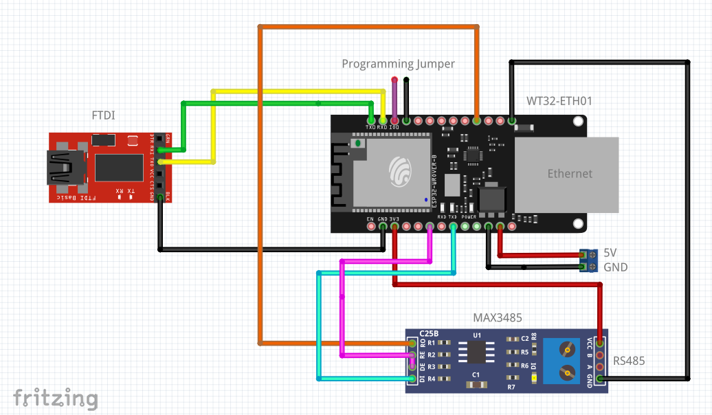

# HM485 Gateway for WT32-ETH01

An ESP32/WT32-ETH01 Ethernet/MQTT gateway for **Homematic Wired / HM485**.


This adapter/gateway makes it possible to connect Homematic Wired (HMW) modules directly to Home Assistant. No CCU or hm485d is required.

The current development version is **v0.9.3g3**. The gateway is in productive use with native HM485 discovery for official HMW devices and additional passive detection of selected HBW/Homebrew devices. States are read and made available via MQTT/Home Assistant, and for explicitly enabled, real-world-tested actuators, commands can also be written.

Write access remains **device- and protocol-specific**. There is no generic write mode for unknown devices.

## Current feature set

- native HM485 discovery across the complete 32-bit prefix tree
- passive detection of HBW/Homebrew devices via valid bus frames and `0x41` identity broadcasts
- no hard-coded device addresses
- automatic querying of device type, serial number and firmware
- reading EEPROM data and channel states for explicitly supported devices
- passive evaluation of HM485 status events for fast state updates
- targeted status polling for devices whose active read path has been verified on real hardware
- persistent device database in NVS; known passive devices are restored after an ESP restart
- targeted verification of restored devices after native discovery
- explicit “Forget device” function, including removal of retained Home Assistant discovery entries
- controlled switching for actuator profiles verified on real hardware
- Ethernet as the primary network connection
- Wi-Fi as fallback
- MQTT with retained states and availability
- Home Assistant MQTT Discovery
- mDNS at `http://<hostname>.local/`
- direct Home Assistant link to the gateway web interface (`configuration_url`)
- stable MQTT paths based on the device serial number
- freely configurable device and channel names
- semantic channel profiles
- NO/NC inversion per channel
- persistent configuration in ESP32 NVS
- web interface with German/English language switching
- configuration/profile backup and restore
- Web OTA
- RAW-RX-Only diagnostic mode with hard TX lockout
- passive HM485 address-conflict protection
- extended ESP32 system diagnostics with chip, RAM, flash, sketch and reset information

## Default credentials / First installation

After a fresh flash without an existing NVS configuration, the following default values apply:

| Function | Default value |
|---|---|
| Web username | `admin` |
| Web password | `hm485setup` |
| Setup AP SSID | `HM485-Gateway-XXXXXX` |
| Setup AP password | `hm485setup` |
| MQTT port | `1883` |
| MQTT Base Topic | `hm485` |
| Home Assistant Discovery Prefix | `homeassistant` |
| Hostname | `hm485-gateway` |
| HM485 central address | `00000001` |
| Web language | German |

`XXXXXX` is derived from the ESP32 chip ID and is different for every gateway.

If neither Ethernet nor a configured Wi-Fi network is available, the gateway provides the setup AP. The setup web interface can then normally be reached via the ESP32 AP address.

**Important:** The username and password should be changed after the initial installation. For parallel operation with an existing HM485/FHEM central unit, the gateway’s own HM485 address should also be changed from `00000001` to, for example, `00000002` before productive testing.

## Hardware

### Controller

- WT32-ETH01 / ESP32
- integrated LAN8720 Ethernet

### RS485 transceiver

Currently tested with a SP485/SP3485-style 3.3 V RS485 transceiver.

Wiring on the WT32:



| Function | GPIO | RS485 module |
|---|---:|---|
| HM485 RX | GPIO35 | RO / RX |
| HM485 TX | GPIO17 | DI / TX |
| Direction | GPIO33 | DE + /RE or RTS |
| GND | GND | GND |

GPIO35 is input-only and has **no internal pull-up** on the ESP32.

### UART

HM485 uses the following parameters:

- 19200 baud
- 8 data bits
- Even parity
- 1 stop bit
- `SERIAL_8E1`

## Important: A/B polarity

Unfortunately, the A/B labeling of RS485 modules is not standardized across manufacturers.

During development it became clear that reversed A/B polarity can still produce signals that look plausible in some cases, while active HM485 communication does not work correctly. With the correct polarity, discovery as well as TYPE, SERIAL, FW, EEPROM and STATUS queries work bidirectionally.

If the setup only produces `00` responses, long LOW levels or no valid responses, A/B polarity should be checked first.

## HM485 address of the gateway

The regular central address is:

```text
00000001
```

For parallel operation with an existing FHEM/HM485 central unit, a different address should be used, for example:

```text
00000002
```

The address can be changed in the web interface.

### Address-conflict protection

After every boot, the gateway first listens passively on the bus. If a valid telegram with the **gateway’s own configured source address** is detected, the gateway disables HM485 TX.

The interface also shows whether the regular central address `00000001` has been seen passively on the bus.

Important: An address that has not been seen is not necessarily free. An existing central unit may simply have remained silent during the observation period.

## Discovery

Native discovery is based on the behavior of `hm485d` / `HM485_Protocol.pm`.

Basic principle:

1. Start at address `00000000` with one valid prefix bit.
2. `CTRL` is generated from the prefix depth.
3. A first received byte other than `00` means: at least one device exists within this prefix branch.
4. A `00` response or timeout is treated as a negative response.
5. Negative prefixes are checked up to three times.
6. The tree is traversed down to the complete 32-bit address.

For official HMW devices, native discovery remains the primary source. HBW/Homebrew devices may intentionally not respond to native prefix discovery and are therefore additionally learned passively.

Known devices are registered persistently in NVS. After an ESP restart, these entries are restored to the runtime device database. This does **not automatically mean “online”**: devices with a safe active read path are explicitly verified after native discovery has completed; purely passive devices remain known until valid bus traffic from them is seen again.

## Device and channel profiles

After discovery, known HM485 device types are assigned to an internal device profile.

Currently included, among others:

- `HMW-Sen-SC-12-DR`
- `HMW-IO-12-Sw14-DR`
- `HBW-1W-T10`
- `HBW-LC-Sw8`
- `HBW-Sen-EP` (currently undergoing real-hardware protocol verification)

### HBW devices currently tested on real hardware

| Type | Device Type | Status |
|---|---:|---|
| HBW-1W-T10 | `0x0081` | Identity and passive temperature values tested on real hardware |
| HBW-LC-Sw8 | `0x0083` | Identity, 8 channels, `53` status polling, `78` switching and `69` feedback tested on real hardware |
| HBW-Sen-EP | `0x0084` | Identity and passive `69` telegrams observed on real hardware; FHEM XML confirms 8 × 16-bit counters as well as `LEVEL_GET`/`INFO_LEVEL`; real input/configuration verification is ongoing |

For the HBW-LC-Sw8, the verified runtime path is:

```text
LEVEL_GET:  53 <channel>
LEVEL_SET:  78 <channel> <00|C8>
INFO_LEVEL: 69 <channel> <00|C8> 00
```

The HBW-LC-Sw8 is deliberately re-polled after one of its own `0x41` identity broadcasts. This ensures that, for example after a module restart, the actual output states are transferred to MQTT/Home Assistant again.

### HBW-Sen-EP (`0x0084`)

The FHEM XML describes the device as **“Homebrew Wired S0 Interface (8-channel)”** with eight `COUNTER_INPUT` channels. The `STATE` transmitted via `INFO_LEVEL` is a **16-bit value** (`0..65535`), not 24 bit.

The documented runtime path is:

```text
LEVEL_GET:  53 <bus-channel>
INFO_LEVEL: 69 <bus-channel> <counter_hi> <counter_lo>
```

According to the XML, `COUNTER` is readable and available as an event. The following EEPROM parameters are also defined per channel:

- `SEND_DELTA_COUNT`: `1..1000`, XML default `1`
- `SEND_MIN_INTERVAL`: `0..3600 s`, XML default `0`
- `SEND_MAX_INTERVAL`: `5..3600 s`, XML default `600`

The currently available Homebrew sources should explicitly be treated as development/experimental code. In that source version, the eight inputs are read cyclically every 10 ms and the counter is incremented on a **LOW→HIGH transition**. The defaults in the source (`SEND_MIN_INTERVAL=10 s`, `SEND_MAX_INTERVAL=150 s`) differ from the FHEM XML. Therefore, for gateway support, the XML is the reference for the device profile; real bus captures remain the reference for the firmware actually flashed onto the module.

Pin/bus-channel mapping in the currently available source version:

| Bus channel | Input | Arduino pin |
|---:|---|---|
| `00` | Sen1 | 14 / A0 |
| `01` | Sen2 | 15 / A1 |
| `02` | Sen3 | 16 / A2 |
| `03` | Sen4 | 17 / A3 |
| `04` | Sen5 | 18 / A4 |
| `05` | Sen6 | 19 / A5 |
| `06` | Sen7 | 6 |
| `07` | Sen8 | 7 |

The important consequence is: **`69 06 ...` belongs to Sen7 / Arduino pin 6, not to `#define Sen6 19`.**

Active polling of the HBW-Sen-EP will only be enabled in the gateway after `53` has been verified on real hardware. Passive evaluation of the `69` counter telegrams is already clear from the protocol perspective.

The web interface shows only the regular Homematic channel number. The internal BUS channel number remains an implementation detail of the code.

Per channel, one of the following profiles can be selected:

- Auto
- Window
- Door
- Alarm
- Contact
- Binary input
- Analog sensor
- Frequency sensor
- Output — read-only or switchable depending on the verified device profile
- Shutter — currently only for known/supported profiles; generic write access remains disabled
- Raw Sensor

### NO/NC inversion

The logical evaluation can be inverted per channel.

The **raw HM485 value remains unchanged**. Only the logical state for MQTT/Home Assistant is inverted.

This is particularly useful for contacts where, depending on NO/NC wiring, `0` may mean either “closed” or “open”.

## MQTT

MQTT paths remain stable regardless of freely assigned display names.

Schema:

```text
<base-topic>/<serial-number>/channel/<channel>/state
```

Example:

```text
hm485/LEQ0251870/channel/11/state
```

Renaming `Channel 11`, for example to `Mailbox`, does **not** change the MQTT path.

The Home Assistant `unique_id` also remains stable. The freely selected name is only the display name.

## Home Assistant

Home Assistant Discovery is generated automatically from the device, serial number, channel and selected semantic profile.

Starting with v0.7.51, every HM485 device created via MQTT Discovery also contains a `configuration_url`. This allows Home Assistant to link directly to the gateway web interface. Instead of a LAN or Wi-Fi IP address, the stable mDNS name is used:

```text
http://hm485-gateway.local/
```

If the hostname is changed, the corresponding URL is `http://<hostname>.local/`. The URL therefore remains the same when switching between Ethernet and Wi-Fi. mDNS is registered again whenever the active network path changes. MQTT and the actual Home Assistant integration do not depend on working `.local` name resolution.

Examples for `device_class`:

| Profile | Home Assistant |
|---|---|
| Window | `window` |
| Door | `door` |
| Alarm | `problem` |
| Contact | `opening` |

After changing a name, profile or inversion setting, Discovery is published again without intentionally creating a new entity ID/`unique_id`.

## Persistence / NVS

The following settings and metadata survive restarts and OTA updates:

- network/MQTT configuration
- web access credentials
- gateway HM485 address
- web language
- device names
- channel names
- semantic channel profiles
- inversion per channel
- cached device metadata
- registry of known device addresses

At boot, the known device list is restored. Devices with `activeReadSafe` are queried explicitly after native discovery. Purely passive devices are not queried blindly but remain stored as known until the next valid bus frame is received.

Using **Forget device**, an entry can deliberately be removed from both the runtime database and NVS. The retained Home Assistant discovery entries and retained state topics for that device are also cleaned up.

## Backup and restore

Starting with v0.7.51, **Backup** provides export and import functions.

The export contains:

- gateway configuration
- Wi-Fi configuration
- MQTT configuration
- web access credentials
- HM485 address
- language
- names/profiles/inversion settings of currently known devices

File format:

```text
HM485GW_BACKUP_V1
```

### Security warning

The backup file contains Wi-Fi, MQTT and web passwords in reversible form.

It should therefore be treated like a password backup and must not be stored publicly.

After an import, the gateway restarts. Devices are then still discovered normally via HM485 discovery.

## Web interface

Starting with v0.7.51, the web interface uses a common navigation structure for:

- Overview
- Configuration
- Backup
- Diagnostics
- Firmware

The language can be changed under Configuration between **German** and **English**. The selection is stored in NVS.

The language selection affects only the web interface. MQTT topics, serial numbers and Home Assistant `unique_id` values remain unchanged.

The **Restart gateway** button is intentionally located under **Diagnostics**, not on the Overview page.

The Diagnostics page also shows ESP32 system information including chip model and revision, CPU frequency/cores, SDK, free and minimum free heap, largest free heap block, flash size and clock, sketch size, free OTA space, PSRAM (if available), reset reason and uptime.

The former passive **Discovery Analyzer** was removed starting with v0.7.51. Once native discovery proved reliable on real hardware, this research mode was no longer required for normal operation. Standard native discovery and the permanent RAW-RX-Only diagnostic mode remain available.

## RAW RX Only

RAW-RX-Only mode is a permanent diagnostic and safety feature.

In this mode:

- DIR remains forced to receive
- HM485 TX is completely blocked
- scan, poll, ACK and discovery are disabled
- the normal parser is bypassed
- raw UART data is logged together with timing information

This feature is intended to remain available in future versions.

## Network

### Ethernet

Ethernet is the primary network path of the WT32-ETH01.

LAN8720 pin assignment:

| Function | GPIO |
|---|---:|
| PHY Clock Enable | GPIO16 |
| MDIO | GPIO18 |
| MDC | GPIO23 |
| REFCLK | GPIO0 |

### Wi-Fi

If Ethernet is not available, Wi-Fi can be used as a fallback. Network parameters are stored via the web interface.

## Firmware update

The firmware can be uploaded through the web interface as an Arduino/ESP32 `.bin` file.

Web access is protected by HTTP Basic Auth.

For recovery purposes, the option to flash the device via the serial interface should still be retained.

## Safety philosophy

The gateway is no longer fundamentally read-only, but write access remains **explicitly limited to known and verified device/channel profiles**.

The following rules currently apply:

- no generic writes to unknown HM485/HBW devices
- no automatic activation of experimental actuator protocols
- EEPROM writes only for explicitly supported and safeguarded configuration paths
- RAW-RX-Only remains a hard diagnostic mode with HM485 TX completely blocked
- known passive HBW devices are not automatically polled actively until their read path has been verified

Development continues step by step based on real bus captures and tests on real hardware.

## Known open issues

- long-term testing in productive operation
- further improve device online/offline and last-seen handling
- test additional HM485/HBW device profiles on real hardware
- HBW-Sen-EP (`0x0084`): verify `53` polling on real hardware, test actual input counting against the pin/bus-channel mapping and document XML/source discrepancies in transmission intervals
- continue versioning Backup/Restore for future NVS schema changes
- enable additional actuator/EEPROM write paths only after real protocol verification

## Version status

This README describes development version **v0.9.3g1**.

For the HBW-Sen-EP, the FHEM files `hbw_sen_ep.xml` / `hbw_sen_ep.pm` as well as the available Homebrew sources were additionally evaluated. Since the source code may contain experimental local modifications, XML, source code and real bus observations are deliberately evaluated separately.

The software was developed iteratively from bus captures, the behavior of `hm485d`, FHEM/HBW device descriptions and tests with real Homematic Wired and Homebrew hardware. Native discovery, passive HBW detection, the persistent device database and RAW-RX-Only remain separate components with different safety responsibilities.
